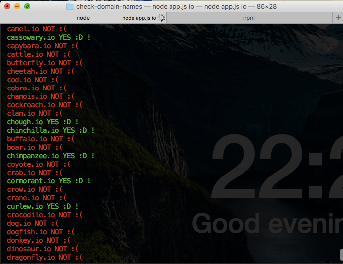

# Check availability of domain names list (JSON)

Do you have a big dictionary of words to check if are available theirs domains in `.com`, `.io`, `.es`, etc?

Check in few seconds ⏱ 😵 
## Requeriments

* Node and npm: https://nodejs.org/en/

## Getting started

1. Clone the repository
2. Execute `$ npm install`
3. Edit `names.json` adding the names that you want to check.
4. Execute `$ node app.js io`. Add at the end `com` if you want to check `.com`, `io` to `.io`, etc.

Hope that finnaly you can find a good domain name 😜

